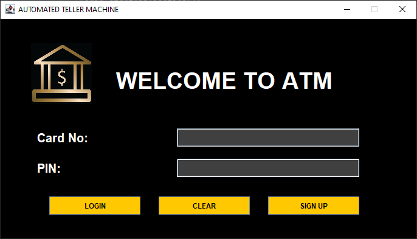
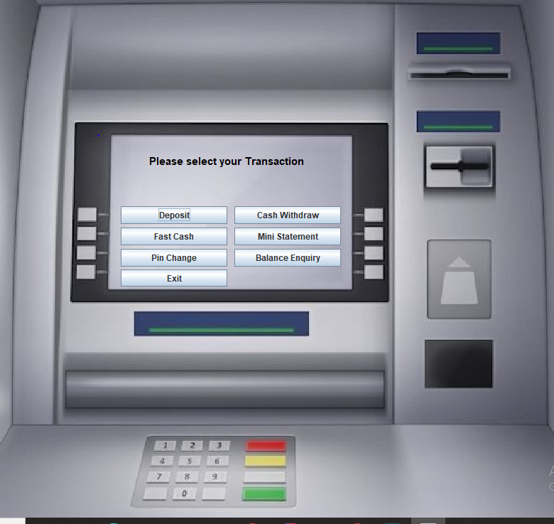
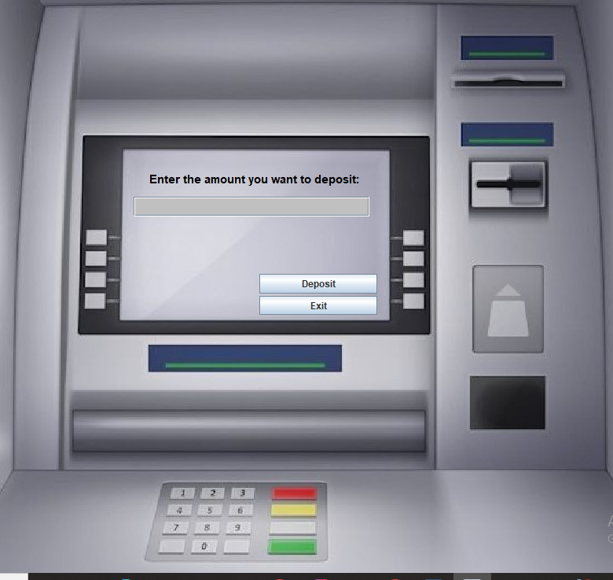
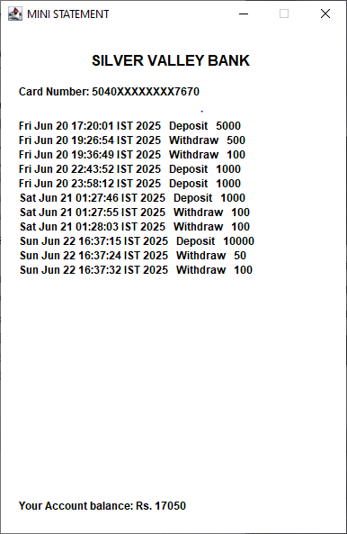
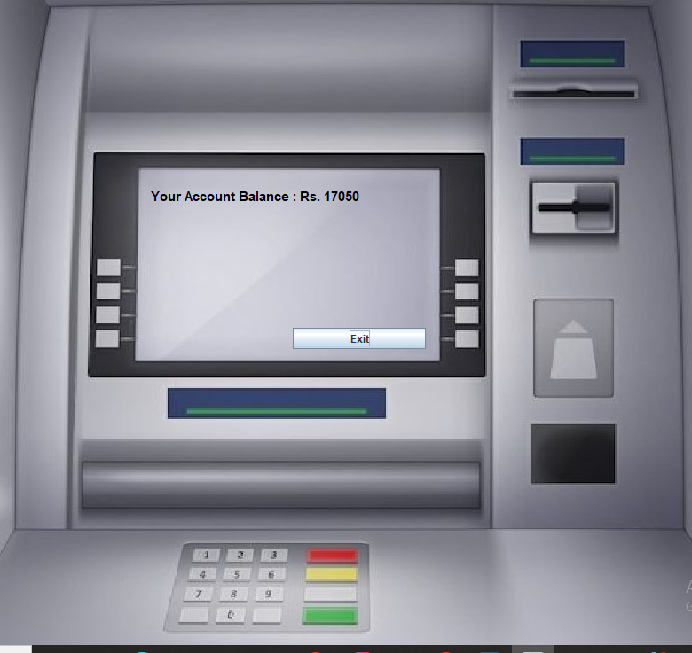
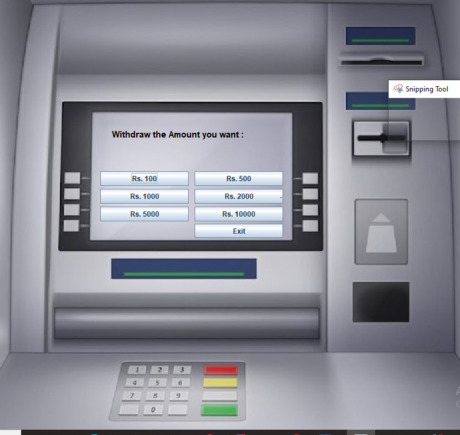
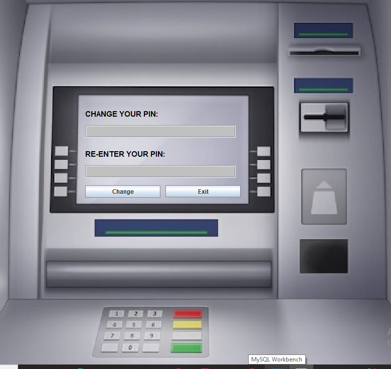
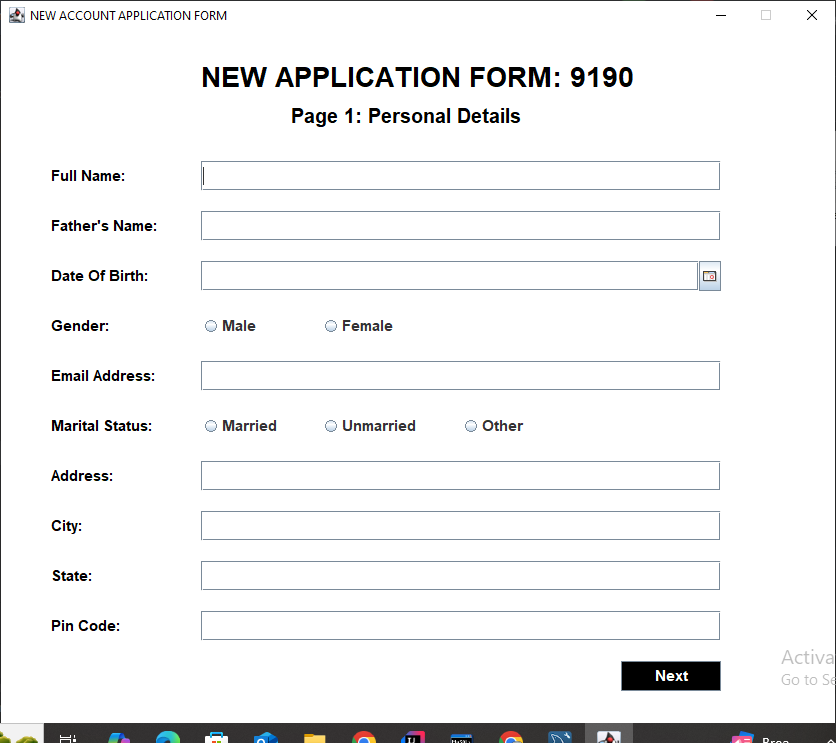
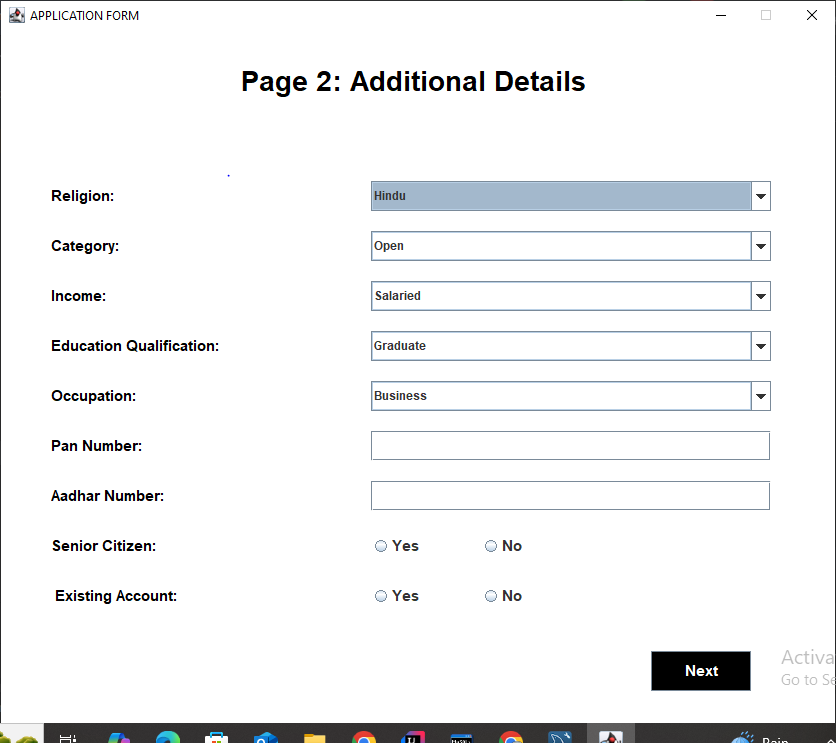
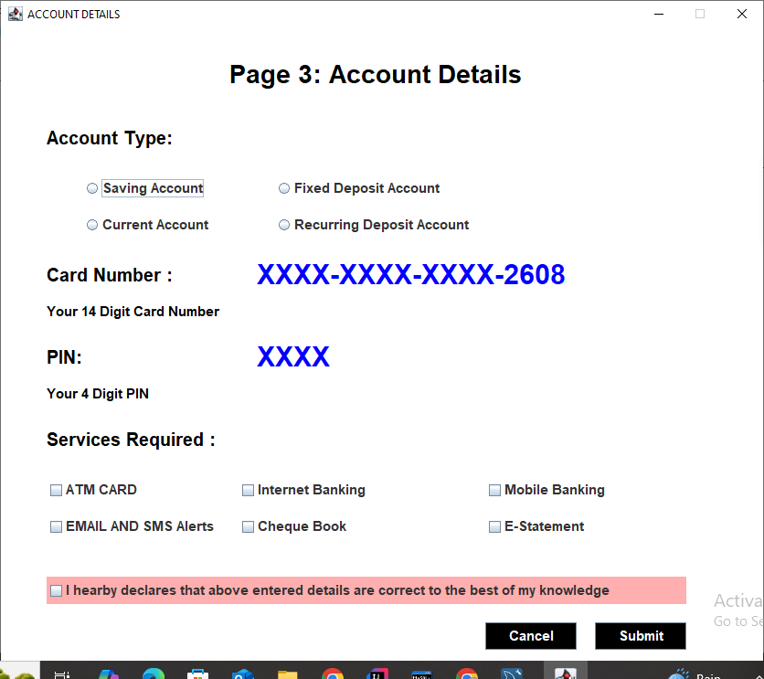

# 💰 Banking System & FitZone Gym Management System

A comprehensive dual-project repository containing two Java desktop applications built with Java Swing and MySQL. This repository showcases the evolution from a **Bank Management System** (ATM simulation) to a **FitZone Gym & Fitness Center Management System** with enhanced security features and robust architecture.

---

## 📋 Table of Contents

- [Abstract](#-abstract)
- [Tech Stack](#-tech-stack)
- [System Architecture](#-system-architecture)
- [Features](#-features)
  - [Bank Management System](#-bank-management-system)
  - [FitZone Gym Management System](#-fitzone-gym-management-system)
- [Database Schema](#-database-schema)
- [Installation & Setup](#-installation--setup)
- [Usage](#-usage)
- [Security Improvements](#-security-improvements)
- [Project Structure](#-project-structure)
- [Screenshots](#-screenshots)
- [Development & Testing](#-development--testing)
- [Troubleshooting](#-troubleshooting)
- [Technologies Used](#-technologies-used)

---

## 📖 Abstract

This repository contains two interconnected Java desktop applications that demonstrate the progression from a basic banking simulation to a comprehensive gym management system:

### Bank Management System
The original project is an ATM simulation application that provides users with essential banking operations including account creation, deposits, withdrawals, balance enquiries, and transaction history. It serves as a foundational project demonstrating Java Swing GUI development and MySQL database integration.

### FitZone Gym Management System
An evolved version of the banking system, transformed into a comprehensive gym membership management platform. FitZone introduces a wallet-based payment system, class booking functionality, health tracking, BMI auto-calculation, and enhanced security measures including SQL injection prevention through PreparedStatement usage.

**Key Highlights:**
- ✅ Dual-system architecture showing project evolution
- ✅ Complete user registration flows with multi-step forms
- ✅ Transaction management with audit trails
- ✅ Real-time BMI calculation and health tracking
- ✅ Wallet-based payment system with balance validation
- ✅ Class booking system with preset options
- ✅ Enhanced security with PreparedStatement and input validation

---

## 💻 Tech Stack

| Component | Technology | Version |
|-----------|-----------|---------|
| **Programming Language** | Java (OpenJDK) | JDK 21 recommended |
| **GUI Framework** | Java Swing | Built-in |
| **Database** | MySQL | 8.0+ |
| **JDBC Driver** | MySQL Connector/J | 9.3.0 |
| **Date Picker** | JCalendar | 1.4 |
| **IDE** | IntelliJ IDEA / NetBeans / Eclipse | Any |
| **Database Server** | XAMPP MySQL / MySQL Server | Latest |

### External Libraries

- **mysql-connector-j-9.3.0.jar** - MySQL database connectivity
- **jcalendar-1.4.jar** - Date picker component for registration forms

---

## 🏗️ System Architecture

### Bank Management System Architecture

```
Bank Management System
│
├── 🖥️ GUI Layer (Java Swing)
│   ├── Main.java (Entry Point)
│   ├── Login.java → Transaction.java (Existing Users)
│   ├── SignUp.java → SignUpTwo.java → SignUpThree.java → Deposit.java (New Users)
│   └── Transaction Operations:
│       ├── Deposit.java
│       ├── Withdrawal.java
│       ├── MiniStatement.java
│       ├── BalanceEnquiry.java
│       ├── FastCash.java
│       └── ChangePin.java
│
├── 🔄 Database Connection Layer
│   └── Conn.java (Database Connectivity)
│
└── 🗄️ Data Layer (MySQL Database)
    └── bank_management_system DB
        ├── login table
        ├── signUp table
        ├── signUpTwo table
        ├── signUpThree table
        └── bank table (All Transactions)
```

### FitZone Gym Management System Architecture

```
FitZone Gym Management System
│
├── 🖥️ GUI Layer (Java Swing)
│   ├── Main.java (Entry Point)
│   ├── Login.java → Dashboard.java (Existing Members)
│   ├── SignUp.java → SignUpTwo.java → SignUpThree.java → AddFunds.java (New Members)
│   └── Dashboard Operations:
│       ├── AddFunds.java
│       ├── RequestRefund.java
│       ├── QuickBook.java
│       ├── WalletBalance.java
│       ├── PaymentHistory.java
│       └── ChangePassword.java
│
├── 🔄 Database Connection Layer
│   └── Conn.java (Database Connectivity with PreparedStatement)
│
└── 🗄️ Data Layer (MySQL Database)
    └── gym_management_system DB
        ├── login table (Authentication)
        ├── member table (Personal details)
        ├── member_health table (Health info + BMI)
        ├── membership table (Plans + Services)
        ├── payments table (Wallet transactions)
        └── bookings table (Class bookings)
```

---

## ✨ Features

### 🏦 Bank Management System

#### 🔐 Authentication
- **Login System**: Secure user authentication with form number tracking
- **Sign Up Process**: Three-step registration process
  - Page 1: Personal details (name, phone, DOB, gender, email)
  - Page 2: Additional details (address, city, state, pincode)
  - Page 3: Account preferences (account type, card requirements)
- **Account Verification**: Comprehensive user data collection across multiple forms

#### 💰 Transaction Operations
- **💳 Deposit**: Add money to your account with transaction tracking
- **💸 Withdrawal**: Withdraw money with type selection (Savings/Current)
- **📄 Mini Statement**: View recent transaction history
- **💰 Balance Enquiry**: Check current account balance
- **⚡ Fast Cash**: Quick withdrawal with preset amounts (₹500, ₹1000, ₹2000, ₹5000, ₹10000, ₹15000)
- **🔢 Change PIN**: Update your account PIN for security

---

### 💪 FitZone Gym Management System

#### 🔐 Member Authentication
- **Secure Login**: Member ID + PIN authentication (10-digit ID, 4-digit PIN)
- **3-Step Registration**: 
  - Page 1: Personal & Contact Details
  - Page 2: Health & Medical Info with BMI auto-calculation
  - Page 3: Membership Plan Selection
- **Auto-Generated Credentials**: Unique Member ID + PIN generated on registration

#### 💰 Wallet & Payments
- **💵 Add Funds**: Top-up your gym wallet (₹100 - ₹50,000)
- **💸 Request Refund**: Withdraw funds with balance validation
- **👛 Wallet Balance**: Check current wallet balance with transaction breakdown
- **📋 Payment History**: View complete transaction history with color-coded entries

#### 📅 Class Booking
- **⚡ Quick Book**: Instant booking for popular classes:
  - 🧘 Yoga (₹300)
  - 💃 Zumba (₹400)
  - 🔥 HIIT Workout (₹500)
  - 🏋️ Personal Training (₹600)
  - 💪 CrossFit (₹350)
  - ❤️ Cardio (₹250)
- **Balance Check**: Automatic balance validation before booking
- **Booking Records**: Complete class booking history

#### 🏋️ Membership Management
- **Multiple Plans**: 
  - Monthly (₹1,500)
  - Quarterly (₹4,000)
  - Semi-Annual (₹7,000)
  - Annual (₹12,000)
- **Additional Services**: 
  - Personal Trainer
  - Yoga Classes
  - Zumba Classes
  - Diet Plan
  - Locker Facility
  - Steam & Sauna
  - Parking
- **Health Tracking**: 
  - BMI auto-calculation from height/weight
  - Medical conditions tracking
  - Fitness goals (Weight Loss, Muscle Gain, Endurance, Flexibility)
  - Experience levels (Beginner, Intermediate, Advanced)
- **Password Change**: Update PIN with transaction safety (commit/rollback)

---

## 🗃️ Database Schema

### Bank Management System Database

**Database:** `bank_management_system`

| Table | Purpose | Key Fields |
|-------|---------|-----------|
| **login** | User authentication | form_no, card_number, pin |
| **signUp** | Personal information | form_no, name, father_name, DOB, gender, email, marital_status, address, city, state, pincode |
| **signUpTwo** | Additional details | form_no, religion, category, income, education, occupation,PAN, Aadhar, senior_citizen, existing_loan |
| **signUpThree** | Account preferences | form_no, account_type, card_type, facilities_required |
| **bank** | Transaction records | card_number, date, transaction_type, amount, balance |

### FitZone Gym Management System Database

**Database:** `gym_management_system`

| Table | Purpose | Key Fields |
|-------|---------|-----------|
| **login** | Member authentication | form_no, member_id, pin |
| **member** | Personal & contact details | form_no, full_name, phone, DOB, gender, email, emergency_contact, address, city, state, pincode |
| **member_health** | Health information | form_no, blood_group, height_cm, weight_kg, BMI, medical_conditions, fitness_goal, experience_level, preferred_time |
| **membership** | Plan & services | form_no, plan_type, member_id, pin, services, join_date, expiry_date, declaration |
| **payments** | Wallet transactions | id, member_id, transaction_date, type (Credit/Debit), description, amount |
| **bookings** | Class bookings | booking_id, member_id, booking_date, class_type, amount, status |

**Run Schema Setup:**
```bash
mysql -u root -p < database_schema.sql
```

---

## 🚀 Installation & Setup

### Prerequisites

Before getting started, ensure you have the following installed:

- ☕ **Java Development Kit (JDK 8 or higher)** - JDK 21 recommended for FitZone
- 🗄️ **MySQL Database Server** (8.0+) - XAMPP MySQL works well
- 💻 **IDE** (IntelliJ IDEA recommended, or NetBeans/Eclipse)
- 📦 **External Libraries** (see below)

### Step 1: Clone the Repository

```bash
git clone https://github.com/yourusername/Banking_System.git
cd Banking_System
```

### Step 2: Database Setup

#### Option A: Automated Setup (Recommended)

Run the PowerShell setup script:

```powershell
cd D:\Coding\Banking_System
.\setup-automated.ps1
```

This script will:
- Check if XAMPP MySQL is running
- Create the required databases
- Set up all tables
- Verify the installation

#### Option B: Manual Setup

1. **Start MySQL** (via XAMPP Control Panel or MySQL service)

2. **Create the databases and tables:**

```bash
# For Bank Management System
mysql -u root -p
CREATE DATABASE bank_management_system;
USE bank_management_system;
-- Run table creation queries

# For FitZone Gym Management System
mysql -u root -p < database_schema.sql
```

3. **Verify tables:**

```sql
USE gym_management_system;
SHOW TABLES;
-- Should show: login, member, member_health, membership, payments, bookings
```

### Step 3: Add External Libraries

1. **Download MySQL Connector/J:**
   - Go to: https://dev.mysql.com/downloads/connector/j/
   - Select "Platform Independent"
   - Download and extract the ZIP
   - Copy `mysql-connector-j-9.3.0.jar` to `lib/` folder

2. **Download JCalendar 1.4:**
   - Go to: https://mvnrepository.com/artifact/com.toedter/jcalendar/1.4
   - Download the JAR file
   - Copy `jcalendar-1.4.jar` to `lib/` folder

3. **Add libraries to your IDE:**
   - **IntelliJ IDEA:**
     - File → Project Structure → Libraries → `+` → Java
     - Select both JAR files from `lib/` folder
     - Click OK
   
   - **NetBeans:**
     - Right-click project → Properties → Libraries
     - Add JAR/Folder → Select JAR files
   
   - **Eclipse:**
     - Right-click project → Build Path → Configure Build Path
     - Libraries tab → Add External JARs

### Step 4: Configure Database Connection

**Option A: Environment Variables (Recommended for FitZone)**

```powershell
# Windows PowerShell
$env:DB_URL="jdbc:mysql://localhost:3306/gym_management_system"
$env:DB_USERNAME="root"
$env:DB_PASSWORD="your_mysql_password"
```

```cmd
# Windows CMD
set DB_URL=jdbc:mysql://localhost:3306/gym_management_system
set DB_USERNAME=root
set DB_PASSWORD=your_mysql_password
```

**Option B: Hardcode in Conn.java**

Update the database credentials in `src/gym_system/repository/Conn.java`:

```java
String url = "jdbc:mysql://localhost:3306/gym_management_system";
String username = "root";
String password = "your_mysql_password";
```

### Step 5: Add Icon Files (Optional)

For better UI appearance, add these files to the `icons/` folder:

- `icons/gym_logo.png` (100x100px recommended)
- `icons/gym_background.jpg` (780x737px or larger)

*Note: Application will run without these but will show warnings.*

### Step 6: Compile and Run

#### Using IntelliJ IDEA (Recommended)

1. Open the project in IntelliJ
2. Mark `src` as Sources Root (right-click → Mark Directory as → Sources Root)
3. Navigate to the desired Main.java:
   - **Bank System:** `src/banking_system/main/Main.java`
   - **Gym System:** `src/gym_system/main/Main.java`
4. Right-click → Run 'Main.main()'

#### Using Command Line

**Bank Management System:**
```bash
javac -d out -cp "lib/*" src/banking_system/main/Main.java src/banking_system/repository/*.java
java -cp "out;lib/*" banking_system.main.Main
```

**FitZone Gym System:**
```bash
javac -d out -cp "lib/*" src/gym_system/main/Main.java src/gym_system/repository/*.java
java -cp "out;lib/*" gym_system.main.Main
```

---

## 📱 Usage

### 🏦 Bank Management System

#### New User Journey

1. **Sign Up Process** 📝
   - Launch the application
   - Click "Sign Up" button
   - **Page 1:** Fill personal details (name, father's name, DOB, gender, email, marital status, address)
   - **Page 2:** Fill additional details (religion, category, income, education, occupation, PAN, Aadhar)
   - **Page 3:** Select account preferences (account type, debit card, credit card, facilities)
   - System generates a unique form number for tracking

2. **Initial Deposit** 💰
   - After signup, you're redirected to Deposit screen
   - Enter initial deposit amount
   - Deposit is recorded in the bank table
   - Account is now active

3. **Login & Transactions** 🔄
   - Enter your credentials (from signup)
   - Access the Transaction Dashboard
   - Perform banking operations:
     - 💳 Deposit funds
     - 💸 Withdraw funds
     - 📋 View Mini Statement
     - 💰 Check Balance
     - ⚡ Fast Cash (preset amounts)
     - 🔢 Change PIN

---

### 💪 FitZone Gym Management System

#### New Member Journey

1. **Registration** 📝
   - Launch the application
   - Click "NEW MEMBER" button
   - **Page 1 - Personal Details:**
     - Full Name
     - Phone Number (10-digit validation)
     - Date of Birth (calendar widget)
     - Gender
     - Email (format validation)
     - Emergency Contact
     - Address, City, State, Pincode
   
   - **Page 2 - Health Information:**
     - Blood Group
     - Height (cm)
     - Weight (kg)
     - **BMI Auto-Calculated** (BMI = weight / (height/100)²)
     - Medical Conditions
     - Previous Injuries
     - Fitness Goal (Weight Loss, Muscle Gain, Endurance, Flexibility)
     - Experience Level (Beginner, Intermediate, Advanced)
     - Preferred Workout Time
   
   - **Page 3 - Membership Plan:**
     - Plan Type (Monthly/Quarterly/Semi-Annual/Annual)
     - Additional Services (select multiple)
     - Declaration checkbox (mandatory)
     - System generates **Member ID (10 digits)** and **PIN (4 digits)**

2. **Initial Wallet Top-Up** 💰
   - New members must add funds to activate account
   - Enter amount (₹100 - ₹50,000)
   - Click "Add Funds"
   - Transaction recorded in payments table
   - Redirected to Dashboard

#### Existing Member Journey

1. **Login** 🔐
   - Enter Member ID (10 digits)
   - Enter PIN (4 digits)
   - Click "LOGIN"
   - Successful login → Dashboard

2. **Dashboard Operations** ⚙️
   - **💰 Add Funds:** Top-up wallet with any amount
   - **💸 Request Refund:** Withdraw funds (balance validation enforced)
   - **⚡ Quick Book Class:** Book from 6 preset classes with instant confirmation
   - **📋 Payment History:** View all transactions with dates, types, and amounts
   - **🔑 Change Password:** Update PIN safely with commit/rollback
   - **👛 Wallet Balance:** Check current balance with transaction summary
   - **🚪 Exit:** Close application

---

## 🔒 Security Improvements

The FitZone Gym System includes significant security enhancements over the original Banking System:

| Feature | Banking System | Gym System | Status |
|---------|---------------|-----------|--------|
| **SQL Injection Prevention** | Uses `Statement` (vulnerable) | Uses `PreparedStatement` | ✅ **Secure** |
| **Input Validation** | Minimal | Comprehensive | ✅ **Robust** |
| **Phone Validation** | None | 10-digit check | ✅ **Validated** |
| **Email Validation** | None | Format check | ✅ **Validated** |
| **Amount Validation** | None | Range checks (₹100-₹50,000) | ✅ **Validated** |
| **PIN Validation** | None | 4-digit format check | ✅ **Validated** |
| **Balance Validation** | No check | Refunds & bookings validated | ✅ **Safe** |
| **Transaction Management** | None | Commit/Rollback for PIN updates | ✅ **Consistent** |
| **Error Handling** | Basic | Proper try-catch with messages | ✅ **User-friendly** |
| **Field Validation** | Some required | All required fields checked | ✅ **Complete** |

### Known Bug Fixes in Gym System

| Issue | Banking System | Gym System | Improvement |
|-------|---------------|-----------|-------------|
| SQL Injection Risk | `Statement` used throughout | `PreparedStatement` everywhere | ✅ **Secure** |
| Services Bug | else-if chain (only 1 service captured) | Independent if statements | ✅ **All services saved** |
| Wrong Window Title | BalanceEnquiry shows "PIN CHANGE" | WalletBalance shows "WALLET BALANCE" | ✅ **Correct** |
| Unsafe Withdrawal | No balance check | Refund validates balance | ✅ **Prevents overdraft** |
| Unsafe PIN Update | Direct update | Transaction with commit/rollback | ✅ **ACID compliant** |

---

## 📁 Project Structure

```
Banking_System/
│
├── 📂 src/
│   ├── 📂 banking_system/              # ORIGINAL: Bank Management System
│   │   ├── 📂 main/
│   │   │   └── ☕ Main.java            # Entry point
│   │   └── 📂 repository/
│   │       ├── 🔗 Conn.java            # Database connection
│   │       ├── 🔐 Login.java           # Login screen
│   │       ├── 📝 SignUp.java          # Registration page 1
│   │       ├── 📝 SignUpTwo.java       # Registration page 2
│   │       ├── 📝 SignUpThree.java     # Registration page 3
│   │       ├── 💳 Transaction.java     # Transaction dashboard
│   │       ├── 💰 Deposit.java         # Deposit screen
│   │       ├── 💸 Withdrawal.java      # Withdrawal screen
│   │       ├── 📄 MiniStatement.java   # Transaction history
│   │       ├── 💰 BalanceEnquiry.java  # Balance check
│   │       ├── ⚡ FastCash.java        # Quick withdrawal
│   │       └── 🔢 PinChange.java       # Change PIN
│   │
│   └── 📂 gym_system/                  # NEW: FitZone Gym Management System
│       ├── 📂 main/
│       │   └── ☕ Main.java            # Entry point
│       └── 📂 repository/
│           ├── 🔗 Conn.java            # Database connection (PreparedStatement)
│           ├── 🔐 Login.java           # Login screen
│           ├── 📊 Dashboard.java       # Member dashboard
│           ├── 📝 SignUp.java          # Registration page 1 (Personal)
│           ├── 📝 SignUpTwo.java       # Registration page 2 (Health + BMI)
│           ├── 📝 SignUpThree.java     # Registration page 3 (Membership)
│           ├── 💰 AddFunds.java        # Wallet top-up
│           ├── 💸 RequestRefund.java   # Withdraw funds
│           ├── ⚡ QuickBook.java       # Class booking
│           ├── 👛 WalletBalance.java   # Balance enquiry
│           ├── 📋 PaymentHistory.java  # Transaction history
│           └── 🔑 ChangePassword.java  # PIN update
│
├── 📂 icons/
│   ├── 🖼️ gym_logo.png                # Login screen logo (100x100)
│   └── 🖼️ gym_background.jpg          # Dashboard background (780x737+)
│
├── 📂 lib/
│   ├── 🔌 mysql-connector-j-9.3.0.jar # MySQL JDBC driver
│   └── 📅 jcalendar-1.4.jar           # Date picker component
│
├── 📂 docs/                            # Documentation
│   ├── 📄 01-prd.md                    # Product Requirements Document
│   ├── 📄 02-tech-stack-mapping.md     # Banking → Gym migration guide
│   ├── 📄 03-test-cases.md             # TDD test cases (50 tests)
│   └── 📄 04-e2e-test-report.md        # E2E test results
│
├── 📄 database_schema.sql              # MySQL schema for gym_management_system
├── 📄 setup-automated.ps1              # Automated setup script
├── 📄 setup.bat                        # Windows batch setup
├── 📄 Banking_System.iml               # IntelliJ module file
├── 📄 Gym_System.iml                   # Gym system module file
├── 📄 .gitignore                       # Git ignore rules
├── 📖 README.md                        # This file
├── 📖 README_GYM.md                    # Gym system documentation
├── 📖 QUICKSTART.md                    # 5-minute setup guide
└── 📖 CHECKLIST.md                     # Setup checklist
```

---

## 📸 Screenshots

### Bank Management System

1. **Login Page** 📱
   

2. **Transaction Dashboard** 💼
   

3. **Deposit Screen** 💰
   

4. **Mini Statement** 📋
   

5. **Balance Enquiry** 🔍
   

6. **Fast Cash** ⚡
   

7. **PIN Change** 🔢
   

8. **Sign-Up Forms** 📝
   
   
   

---

## 🛠️ Development & Testing

### Running the Automated Setup

```powershell
.\setup-automated.ps1
```

This script will:
- Check MySQL connectivity
- Create databases if they don't exist
- Set up all required tables
- Verify installation
- Report any issues

### Test Flow (For FitZone Gym System)

1. **Registration Test** (3 min)
   - Click "NEW MEMBER"
   - Fill Page 1: John Doe, 9876543210, DOB, Male, email, address
   - Fill Page 2: O+, 175cm, 70kg (BMI auto-calculates to 22.86), Weight Loss, Beginner
   - Fill Page 3: Quarterly plan, check Yoga + Personal Trainer, agree declaration
   - **Note:** Member ID (10 digits) and PIN (4 digits)

2. **Initial Deposit Test** (1 min)
   - Add ₹10,000
   - Verify success message

3. **Login Test** (1 min)
   - Close and re-run app
   - Login with Member ID + PIN
   - Verify dashboard loads

4. **Wallet & Booking Test** (3 min)
   - Check Wallet Balance: Should show ₹10,000
   - Quick Book: Book Yoga (₹300) + HIIT (₹500)
   - Check Wallet Balance: Should show ₹9,200
   - Payment History: Shows 3 transactions (1 Credit, 2 Debits)

5. **Security Test** (2 min)
   - Try invalid phone/email during registration
   - Try booking with insufficient funds
   - Change password and re-login with new PIN
   - Verify all validations work

### Common Issues & Fixes

| Issue | Solution |
|-------|----------|
| **"Database connection failed"** | Ensure MySQL is running in XAMPP (green status) |
| **"ClassNotFoundException"** | Verify JAR files are added to project libraries |
| **"Table doesn't exist"** | Run `database_schema.sql` in MySQL or `.\setup-automated.ps1` |
| **Application won't start** | Check console for red error messages |
| **Icons not loading** | Create placeholder images or ignore warnings |
| **Compilation errors in SignUpTwo** | Ensure JCalendar library is added |

---

## 🎯 Key Features Highlighted in Demos

### FitZone Gym System Demo Highlights

| Feature | What It Shows | Why It Matters |
|---------|--------------|----------------|
| **BMI Auto-Calculation** | Real-time calculation from height/weight | Demonstrates computed fields |
| **Wallet System** | Credit/Debit tracking like digital wallet | Shows transaction management |
| **Balance Validation** | Prevents overdrafts in bookings/refunds | Business logic enforcement |
| **Quick Booking** | Preset class options with instant confirmation | User-friendly UX |
| **Payment History** | Complete audit trail with color-coded transactions | Data integrity |
| **Transaction Safety** | PreparedStatement, commit/rollback for PIN updates | Security & ACID compliance |
| **Input Validation** | Phone, email, amount, PIN format checks | Data quality & security |

---

## 📊 Technologies Used

### Core Technologies

- ☕ **Java (OpenJDK)** - Primary programming language
- 🖥️ **Java Swing** - GUI framework for desktop windows
- 🗄️ **MySQL 8.0+** - Relational database management
- 🔗 **JDBC (Java Database Connectivity)** - Database connectivity layer
- 📅 **JCalendar 1.4** - Date picker for registration forms

### Development Tools

- 💻 **IntelliJ IDEA** - Recommended IDE (also works with NetBeans/Eclipse)
- 🐬 **XAMPP** - Local MySQL server (alternative: standalone MySQL)
- 🔧 **Git** - Version control
- 📝 **Markdown** - Documentation format

### External Dependencies

- **mysql-connector-j-9.3.0.jar** - MySQL JDBC driver
- **jcalendar-1.4.jar** - JCalendar date picker component

---

## 📚 Additional Resources

### Documentation

- **Full Documentation:** See `README_GYM.md` for comprehensive gym system guide
- **Quick Start Guide:** See `QUICKSTART.md` for 5-minute setup
- **Setup Checklist:** See `CHECKLIST.md` for step-by-step installation
- **Technical Docs:** See `docs/` folder for PRD, test cases, and migration guides

### Useful MySQL Queries

```sql
-- Check all tables exist
SELECT TABLE_NAME FROM INFORMATION_SCHEMA.TABLES 
WHERE TABLE_SCHEMA = 'gym_management_system' ORDER BY TABLE_NAME;

-- Calculate wallet balance for a member
SELECT 
    SUM(CASE WHEN transaction_type = 'Credit' THEN amount ELSE -amount END) as balance
FROM payments WHERE member_id = 'YOUR_MEMBER_ID';

-- Get member's booking history
SELECT b.*, m.full_name
FROM bookings b
JOIN membership ms ON b.member_id = ms.member_id
JOIN member m ON ms.form_no = m.form_no
WHERE b.member_id = 'YOUR_MEMBER_ID' 
ORDER BY b.booking_date DESC;
```

---

## 🐛 Known Issues & Limitations

- Icon files are optional; application runs without them with warnings
- Bank Management System uses `Statement` which is vulnerable to SQL injection (fixed in Gym System)
- Some window titles in Bank System may be incorrect (fixed in Gym System)
- Balance validation is missing in Bank System withdrawals (added in Gym System)

---

## 🎓 Academic Use

This project is ideal for:
- College presentations and demonstrations
- Learning Java Swing GUI development
- Understanding JDBC and database integration
- Demonstrating code refactoring and security improvements
- Showcasing project evolution and best practices

**Demo Script Suggestion (10 minutes):**
1. Show Login screen → Explain UI and theme (1 min)
2. Register new member → Complete 3-page signup with BMI calc (3 min)
3. Show generated credentials → Member ID + PIN (1 min)
4. Make initial payment → Add ₹10,000 to wallet (1 min)
5. Login with new member → Show dashboard (1 min)
6. Quick book classes → Book Yoga + HIIT (show balance deduction) (2 min)
7. View payment history → Show all transactions (1 min)
8. Check wallet balance → Show calculation (₹10,000 - ₹300 - ₹500 = ₹9,200) (1 min)
9. Change password → Show PIN update with transaction safety (1 min)
10. Request refund → Show balance validation (1 min)

---

## 🤝 Contributing

Contributions are welcome! Please feel free to submit issues or pull requests for improvements, bug fixes, or feature enhancements.

---

**⭐ Don't forget to star this repository if you found it helpful!**

**🏦💪 Happy Coding & Fitness Journeying!**

---

*Built with ❤️ using Java, Swing, and MySQL*
